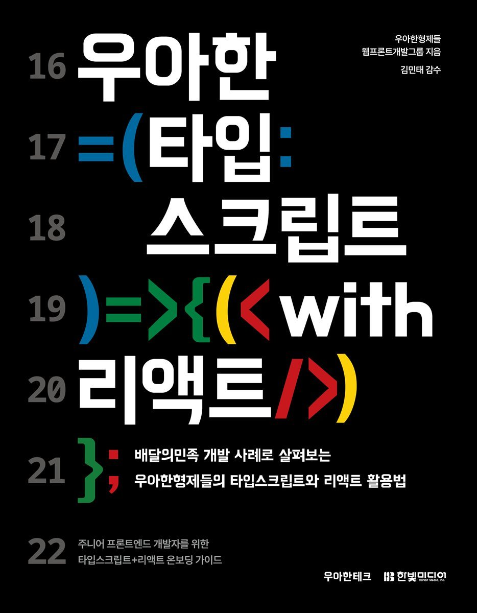

# 🚀 [우아한 타입스크립트 with 리액트] 스터디 🚀

|  |
| ------------------------------------------------------ |

 

## ✨ 스터디 방식 ✨

- 스터디는 주 1회 대면으로 진행됩니다.
- 매주 하나의 챕터를 모든 인원이 공부하고 랜덤으로 한명이 발표를 진행합니다.
- Branch는 스터디 인원 이름으로 생성합니다.
  - FE/avatar1
  - FE/avatar2
- 챕터별 파일 안에 스터디 인원의 이름으로 파일을 생성합니다.
  - 챕터 1
    - avatar1
    - avatar2
- 대면 회의 전날까지 본인의 파일 안에 markdown으로 배운 내용을 정리하고 Pull Request를 보냅니다.
- 대면 회의가 끝난 당일, Squash & Merge를 진행합니다.

 

## 📅 일정표 📅

<table>
<tbody>
<tr>
<td align="center" colspan="5">1주차</td>
</tr>
<tr>
<td align="center">7/30(화)</td>
<td colspan="4">OT</td>
</tr>
<tr>
<td align="center" colspan="5">2주차</td>
</tr>
<tr>
<td align="center">8/6(화)</td>
<th align="left">[2장] 타입</th>
<td><a href="">정리</a></td>
<td><a href="">문제</a></td>
<td>미정</td>
</tr>
</tbody>
</table>

 

## 😎 스터디원 😎

<table>
<tbody>
<tr>
<td align="center"></td>
<td align="center"></td>
<td align="center"></td>
<td align="center"></td>
</tr>
<tr>
<th align="center">박진수</th>
<th align="center">이무성</th>
<th align="center">남윤지</th>
<th align="center">박혜정</th>
</tr>
<tr>
<td align="center" width="150"><a href="https://github.com/jinsupark4255">@jinsupark4255</a></td>
<td align="center" width="150"><a href="https://github.com/dlantjdgkgk">@dlantjdgkgk</a></td>
<td align="center" width="150"><a href="https://github.com/YunjiNam">@YunjiNam</a></td>
<td align="center" width="150"><a href="https://github.com/hyejj19">@hyejj19</a></td>
</tr>
</tbody>
</table>

